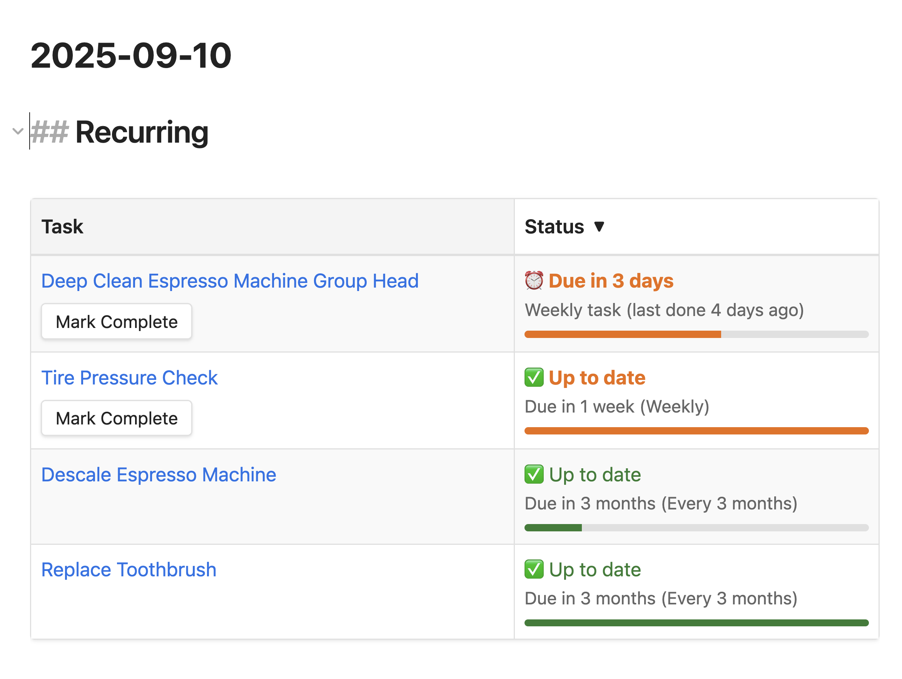

# Recurring Upkeep Scheduler

Never forget important maintenance again. Track when you last did recurring tasks and get visual reminders when they're due.



## What It Does

Turn any note into a recurring task tracker. The plugin shows you:
- **Red**: Overdue tasks that need attention
- **Green**: Up to date tasks 

Click a button to mark tasks complete, and the plugin automatically calculates your next due date.

## Perfect For

- **Bicycle Maintenance**: Tire pressure, brake checks, chain lubing
- **Coffee Equipment**: Descaling, deep cleaning, filter replacements
- **Plant Care**: Watering schedules, fertilizing, repotting
- **Health**: Medical checkups, prescription refills, dental cleanings
- **Personal Care**: Toothbrush replacement, grooming appointments
- **Home Safety**: Smoke detector batteries, first aid kit checks

## Quick Start

### 1. Create a Task Note

Make a new note for something you need to do regularly. **Put the frontmatter at the very top, then add your detailed content below**:

```markdown
---
tags:
  - recurring-task
last_done: 2024-03-10
interval: 2
interval_unit: weeks
---

# Water Fiddle Leaf Fig

## Care Instructions

- Water when top inch of soil is dry
- Use filtered water at room temperature
- Water until drainage appears in saucer
- Remove excess water after 30 minutes

## Signs to Watch

- Drooping leaves = needs water
- Yellow leaves = overwatered
- Brown spots = water quality issues

## Photos


```

### 2. See All Your Tasks

Create a dashboard note to see everything at once:

````markdown
# My Maintenance Schedule

```recurring-upkeep-table
```
````

This shows all your recurring tasks with status colors and completion buttons.

### 3. Check Individual Tasks

Add a status widget to any note:

````markdown

```recurring-upkeep-status
```
````

## More Examples

See the [examples/](examples/) folder for detailed maintenance guides including bicycle care, coffee machine maintenance, and personal care tracking.

## How the Status System Works

**Overdue** (Red): Past the due date - needs attention

**Up to Date** (Green): Not due yet - you're staying on top of things

## Settings

**Language**: Choose between English and German for all text and status messages

## Installation

**Install via [BRAT](https://github.com/TfTHacker/obsidian42-brat) (Beta Reviewer's Auto-update Tool):**

1. Install [BRAT plugin](https://github.com/TfTHacker/obsidian42-brat) if you don't have it
2. In BRAT settings, add this repository: `peritus/obsidian-recurring-upkeep-scheduler`
3. BRAT will install and keep the plugin updated

**Requirements**: Make sure you have the Dataview plugin installed (required dependency)

## Quick Tips

- Use descriptive note titles like "Water Fiddle Leaf Fig" or "Descale Espresso Machine"
- Create one dashboard note with the table view to see everything at a glance
- The plugin automatically archives your completion history

## Filtering Your Tasks

Show only overdue tasks:
````markdown
```recurring-upkeep-table
status:overdue
```
````

Show only bicycle-related tasks:
````markdown
```recurring-upkeep-table
tag:bicycle
```
````

## Need Help?

Check the [GitHub repository](https://github.com/peritus/obsidian-recurring-upkeep-scheduler) for troubleshooting and feature requests.

## License

MIT
